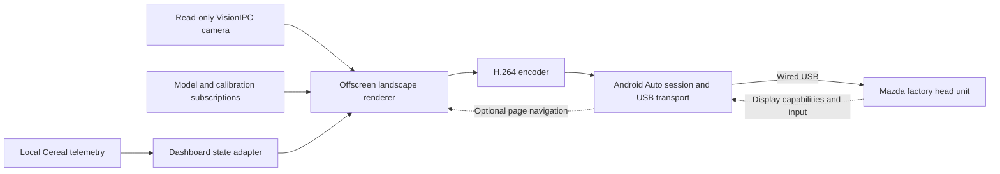

# Architecture and decisions

Status: direct USB transport, strict Mazda authentication, and live on-device
HUD rendering/encoding work. Real camera/model composition is implemented and
has sustained direct Mazda delivery evidence at the current 8 fps default.
See [in-car evidence](in-car.md) and the [live runbook](live.md).
Scope authority: [project brief](README.md).

## Runtime shape

All components left of the Mazda run on comma four. The car acts as USB host; the
comma must expose the appropriate USB peripheral/accessory behavior. Ordinary
host-side libusb access is not sufficient. The existing OBD-C connection remains
the power/CAN path; use the separate data port for projection and verify both
connections together before assuming independent operation.

Start with a manually launched experimental service outside the control loop.
Keep privileged USB setup separate from the renderer where practical. Do not add
automatic startup until manual start, stop, cleanup, and reconnect are reliable.

## Implementation and protocol references

The implemented sender is Python, using AGNOS's existing accessory driver and
two-stage AOA negotiation. [AACS](https://github.com/tomasz-grobelny/AACS)'s
car-facing `AAServer` supplied protocol and descriptor reference facts;
its phone-facing `AAClient`, Odroid setup, and GStreamer/Snowmix stack are not
runtime dependencies. No AACS implementation is vendored.

`tools/android_auto/session.py` implements phone-side TLS/framing over a socket
shared by the DHU TCP and comma USB transports. A current phone identity
imported from a verified Google-signed Android Auto APK passes DHU authentication
and encrypted service discovery. The separate, optional sender-side verification
of DHU fails on its certificate's date encoding with this Mac's OpenSSL. See the
[certificate experiment](authentication.md) for evidence and limits. Strict
mutual authentication succeeds separately with the actual Mazda on the comma.

`tools/android_auto/video.py` now opens the video channel, handles focus and
bounded acknowledgement flow, sends H.264, and closes cleanly against stock DHU.
`preview.py` supplies a pre-rendered synthetic 3X HUD clip at multiple sizes. See
the [video evidence](video.md). `live_session.py` extends this with bounded live
flow, focus epochs, and mandatory resume keyframes. `usb.py` supplies working
AGNOS accessory transport. `runtime.py` drives a separately terminable
`frame_worker.py`, which reads current telemetry, renders, and encodes each
requested frame. A fixed shared buffer and one outstanding request prevent a
frame backlog. `service.py` contains the manual, resource-limited launch.

Treat identity provisioning as a development/deployment step separate from the
runtime. The comma needs the certificate and matching key, not Android or the APK.
Keep those artifacts outside Git, record expiry, and plan a refresh before the
tested identity expires on December 23, 2026. The importer deliberately supports
one inspected APK; updating it requires inspecting and testing the newer release.

[OpenAuto](https://github.com/opencardev/openauto) implements the receiving head
unit, so it is useful as a development peer rather than the runtime sender.
[aa-proxy-rs](https://github.com/aa-proxy/aa-proxy-rs) is useful for USB/session
handling and inspection techniques; its normal phone dependency does not meet our
runtime requirement. [open-android-auto](https://github.com/mrmees/open-android-auto)
provides protocol definitions with varying confidence annotations; validate the
subset used against the actual head unit.

## Component contracts

| Component | Input | Output and responsibilities |
| --- | --- | --- |
| USB setup/transport | Physical attachment, existing gadget/role state | Accessory enumeration and byte transport; owns only its configured resources; restores prior state on exit |
| Session | Transport bytes, encoded video | Negotiation, authentication, service discovery, channel lifecycle, video focus, acknowledgements, keepalive, teardown |
| State adapter | Local Cereal subscriptions, units preference | Immutable display snapshot with validity, age, and source mode; no publishing to vehicle-control services |
| Renderer | Snapshot, negotiated viewport, optional page input | Offscreen frames with readable layout and a visible stale/replay state |
| Encoder | Offscreen frames and accepted video configuration | H.264 access units, timestamps, codec headers, and keyframes compatible with the session |

Logical session progression is `detached -> enumerating -> negotiating ->
ready -> streaming`. A failure returns through cleanup to a bounded retry state.
These are proposed application states, not assertions about exact Android Auto
message ordering. Determine the wire sequence from the implementation and traces.

Treat reattachment as a fresh session: rediscover capabilities, reset session IDs
and timing, send required codec headers and a keyframe, and discard old queued
video. Bound all queues. Drop obsolete unencoded frames rather than accumulating
latency; if encoded data must be discarded, resume at a decodable keyframe rather
than forwarding broken inter-frame dependencies.

## Data and presentation

`live_state.py` reads `carState`, `selfdriveState`, Sunnypilot state, panda state,
device state, and onroad events, with legacy `controlsState` only when needed.
It reads the native unit/visibility preferences without changing Params. Sources:

| Display | Source | Implemented semantics |
| --- | --- | --- |
| Vehicle speed | `carState.vEgoCluster`, falling back to `vEgo` | Native seen-cluster fallback, TrueVEgoUI/HideVEgoUI, unit conversion; zero is valid |
| Cruise set speed | `carState.vCruiseCluster` | Native sentinel, availability, and legacy controlsState fallback |
| Openpilot state | `selfdriveState`, `selfdriveStateSP` | Native branch order for engaged, override, disengaged, lateral-only, and longitudinal-only |
| Alert | `alertText1`, `alertText2`, `alertStatus`, `alertSize` | Native text and severity; native audio continues independently |
| Data quality | Subscription validity/liveness and timestamps; `carState.canValid` | CAN validity and telemetry freshness are distinct |

MADS handling is derived from this fork's existing state logic; `enabled` alone
does not mean both axes are active. Branch-parity tests cover the adapter;
physical comparison across moving states remains pending.

Use the existing landscape comma 3X UI as the visual target, per Alex's updated
preference. Shared native speed/MAX painters are already used in the local
preview; the [interface plan](interface.md) maps the camera/model/alert reuse.
Do not assume
touch input or a particular native resolution. Commander events now navigate
the projection-only menu, with explicit OEM exit and local display selection.
The [display coordinator](controls.md) grants expiring leases to suppress native
drawing only while video is fresh, focused, and acknowledged. State/input updates
remain active and a local touch revokes the lease.

Use monotonic timestamps and an explicit mode (`live`, `replay`, `synthetic`).
The live worker uses a 350 ms high-rate source threshold and a separate 500 ms
sender freshness budget, leaving time to encode an unavailable frame. Lower-rate
device/events/calibration services have longer deadlines. Missing/stale state displays "Data
unavailable" instead of retaining an active indicator. A new AA session starts
with no live state until valid samples arrive.

## Rendering and encoding strategy

First prove protocol/video with a pre-encoded test pattern in a configuration the
head unit accepts. Then render a synthetic dashboard and feed an encoder. Only
then attach live telemetry. This separates USB/session failures from graphics and
codec failures.

The working encoder is isolated PyAV 16.1.0 with single-thread libx264,
baseline/ultrafast/zerolatency and repeated codec headers. It does not claim a
native camera encoder session. The proven negotiated mode is 1280×720/30 with
240 total vertical margin. Source updates can run at 8, 10, 15, or 30 fps independently
of the codec mode. The full road view defaults to 8 fps after CPU profiling;
higher requested rates remain available for measured experiments.

Rendering uses Pillow with a passive drawing backend for the shared native HUD
painters. Camera/model composition uses copied latest VisionIPC NV12 frames and
native calibration/projection math, without opening a second native UI window or
GPU context. A HUD-only view remains available. Hardware encoding is a later
optimization requiring its own input-format and concurrent-capacity evidence.

## Existing code to inspect

Paths are relative to the repository root and are reference points, not planned
edit requirements:

- `opendbc_repo/opendbc/car/car.capnp`: `CarState` and `CarControl` schemas.
- `openpilot/cereal/log.capnp`: `SelfdriveState` schema and alert/state enums.
- `openpilot/cereal/services.py`: service names and frequencies.
- `openpilot/selfdrive/ui/ui_state.py` and
  `openpilot/selfdrive/ui/sunnypilot/onroad/speed_renderer.py`: display conventions.
- `openpilot/system/webrtc/webrtcd.py`: `CerealOutgoingMessageProxy` illustrates
  telemetry serialization. Reuse the pattern, not an assumed WebRTC dependency.
- `openpilot/system/manager/process_config.py`: process lifecycle and livestream
  conditions. Existing WebRTC is not automatically an onroad UI stream.
- `openpilot/system/loggerd/encoder/v4l_encoder.{h,cc}`: hardware encoding,
  callbacks, buffers, and keyframe requests.
- `openpilot/common/hardware/usb.py`: USB topology diagnostics; host-device
  enumeration here does not prove gadget capability.

## Decision record

| ID | Decision | Status / rationale |
| --- | --- | --- |
| D1 | Direct wired projection, no intermediary | Agreed with Alex; central project objective |
| D2 | Read-only dashboard, separate from control | Implemented with subscriber-only state, isolated deployment, and bounded worker |
| D3 | Test pattern before live dashboard | Completed; synthetic then live HUD confirmed on actual Mazda |
| D4 | Use the minimal Python sender with AGNOS's existing accessory driver | Demonstrated on Mazda; AACS supplies protocol/negotiation reference facts, with no AACS implementation vendored |
| D5 | Use an offscreen landscape renderer | Pillow CPU backend demonstrated; preserves native UI and adapts to measured margins |
| D6 | Manual launch before manager integration | Transient systemd service, no boot/manager integration; owned-gadget crash cleanup tested |
| D7 | Reuse the scalable comma 3X onroad interface | Live shared native HUD demonstrated; real camera/model view now prioritized by Alex |

Driving-load performance, physical focus/reconnect behavior, and full visual
parity remain experimental. Keep the synthetic and live HUD paths for
regression diagnosis while extending the road view.
