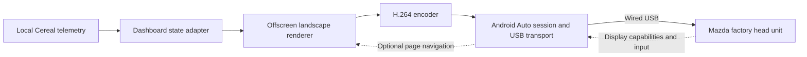

# Architecture and decisions

Status: direct USB transport, strict Mazda authentication, and prerecorded video
work on the device. Live renderer/encoder integration remains proposed; see
[in-car evidence](in-car.md).
Scope authority: [project brief](README.md).

## Runtime shape

All components left of the Mazda run on comma four. The car acts as USB host; the
comma must expose the appropriate USB peripheral/accessory behavior. Ordinary
host-side libusb access is not sufficient. The existing OBD-C connection remains
the power/CAN path; use the separate data port for projection and verify both
connections together before assuming independent operation.

Start with a manually launched experimental service outside the control loop.
Keep privileged USB setup separate from the renderer where practical. Do not add
automatic startup until manual start, stop, cleanup, and reconnect are reliable.

## Candidate implementation

Start by inspecting and building the smallest useful portion of
[AACS](https://github.com/tomasz-grobelny/AACS), especially `AAServer`. Despite the
name, that component faces the car and provides the role we need. Its `AAClient`
component faces a real Android phone and is not required by our objective.

AACS is a candidate, not a locked dependency. Its documented environment includes
Odroid, GStreamer/Snowmix, and kernel-specific gadget considerations. Its install
guide is not a script to run wholesale on AGNOS. Inspect the minimum video path,
build requirements, license compatibility, and USB assumptions first; pin any
reused dependency to a reviewed revision and retain attribution.

Local experiment: `tools/android_auto/session.py` now implements a small Python
phone-side TLS/framing probe against stock DHU over TCP. A current phone identity
imported from a verified Google-signed Android Auto APK passes DHU authentication
and encrypted service discovery. The separate, optional sender-side verification
of DHU fails on its certificate's date encoding with this Mac's OpenSSL. See the
[certificate experiment](authentication.md) for evidence and limits. This is not
yet a selection of Python for the final runtime or proof of Mazda compatibility.

`tools/android_auto/video.py` now opens the video channel, handles focus and
bounded acknowledgement flow, sends H.264, and closes cleanly against stock DHU.
`preview.py` supplies a pre-rendered synthetic 3X HUD clip at multiple sizes. See
the [video evidence](video.md). Live rendering/encoding is not yet connected to
the session. `usb.py` now supplies a working AGNOS accessory transport with bounded
setup/cleanup and strict head-unit verification; live integration remains pending.

Treat identity provisioning as a development/deployment step separate from the
runtime. The comma needs the certificate and matching key, not Android or the APK.
Keep those artifacts outside Git, record expiry, and plan a refresh before the
tested identity expires on December 23, 2026. The importer deliberately supports
one inspected APK; updating it requires inspecting and testing the newer release.

If AACS's transport cannot be adapted economically, use its behavior and the
protocol references to implement a minimal sender on the comma. That is an
implementation change within the agreed scope. Phone proxying is a scope change.

[OpenAuto](https://github.com/opencardev/openauto) implements the receiving head
unit, so it is useful as a development peer rather than the runtime sender.
[aa-proxy-rs](https://github.com/aa-proxy/aa-proxy-rs) is useful for USB/session
handling and inspection techniques; its normal phone dependency does not meet our
runtime requirement. [open-android-auto](https://github.com/mrmees/open-android-auto)
provides protocol definitions with varying confidence annotations; validate the
subset used against the actual head unit.

## Component contracts

| Component | Input | Output and responsibilities |
| --- | --- | --- |
| USB setup/transport | Physical attachment, existing gadget/role state | Accessory enumeration and byte transport; owns only its configured resources; restores prior state on exit |
| Session | Transport bytes, encoded video | Negotiation, authentication, service discovery, channel lifecycle, video focus, acknowledgements, keepalive, teardown |
| State adapter | Local Cereal subscriptions, units preference | Immutable display snapshot with validity, age, and source mode; no publishing to vehicle-control services |
| Renderer | Snapshot, negotiated viewport, optional page input | Offscreen frames with readable layout and a visible stale/replay state |
| Encoder | Offscreen frames and accepted video configuration | H.264 access units, timestamps, codec headers, and keyframes compatible with the session |

Logical session progression is `detached -> enumerating -> negotiating ->
ready -> streaming`. A failure returns through cleanup to a bounded retry state.
These are proposed application states, not assertions about exact Android Auto
message ordering. Determine the wire sequence from the implementation and traces.

Treat reattachment as a fresh session: rediscover capabilities, reset session IDs
and timing, send required codec headers and a keyframe, and discard old queued
video. Bound all queues. Drop obsolete unencoded frames rather than accumulating
latency; if encoded data must be discarded, resume at a decodable keyframe rather
than forwarding broken inter-frame dependencies.

## Data and presentation

Initial subscriptions: `carState` and `selfdriveState`. Read `IsMetric` through
the existing parameter API. Candidate fields are:

| Display | Candidate source | Semantics to verify |
| --- | --- | --- |
| Vehicle speed | `carState.vEgoCluster`, falling back to `vEgo` | Match existing UI fallback and unit conversion; zero speed is valid |
| Cruise set speed | `carState.vCruiseCluster` | Match current fork's validity/sentinel and legacy fallback behavior; do not assume the same units as `vEgo` |
| Openpilot state | `selfdriveState.state`, `enabled`, `active` | Preserve pre-enabled, overriding, and disabling distinctions |
| Alert | `alertText1`, `alertText2`, `alertStatus`, `alertSize` | Preserve meaning and priority; native alerts continue independently |
| Data quality | Subscription validity/liveness and timestamps; `carState.canValid` | CAN validity and telemetry freshness are distinct |

If individual lateral/longitudinal activity is shown later, inspect `carControl`
and the fork's MADS handling; `enabled` alone does not mean both axes are active.

Use the existing landscape comma 3X UI as the visual target, per Alex's updated
preference. Shared native speed/MAX painters are already used in the local
preview; the [interface plan](interface.md) maps the camera/model/alert reuse.
Do not assume
touch input or a particular native resolution. Commander events are optional for
the core demo, but the session must tolerate the head unit's input messages.

Use monotonic timestamps and an explicit mode (`live`, `replay`, `synthetic`).
The proposed initial stale threshold is 500 ms without a required valid update;
measure and revise it explicitly. Missing/stale state must display "Data
unavailable" instead of retaining an active indicator. A new AA session starts
with no live state until valid samples arrive.

## Rendering and encoding strategy

First prove protocol/video with a pre-encoded test pattern in a configuration the
head unit accepts. Then render a synthetic dashboard and feed an encoder. Only
then attach live telemetry. This separates USB/session failures from graphics and
codec failures.

Prefer the existing hardware encoder path after evaluating its input-buffer
requirements and ability to coexist with openpilot's encoders. Existing H.264
support does not establish spare hardware sessions or compatibility with the
head unit's profile/level. Existing camera streams are not rendered UI frames.

Software encoding on the comma is an acceptable temporary experiment if measured
load permits it. It still satisfies direct projection. Negotiate resolution and
frame rate rather than hardcoding the panel's physical dimensions. A simple
dashboard should prioritize readable, fresh data over camera video.

## Existing code to inspect

Paths are relative to the repository root and are reference points, not planned
edit requirements:

- `opendbc_repo/opendbc/car/car.capnp`: `CarState` and `CarControl` schemas.
- `openpilot/cereal/log.capnp`: `SelfdriveState` schema and alert/state enums.
- `openpilot/cereal/services.py`: service names and frequencies.
- `openpilot/selfdrive/ui/ui_state.py` and
  `openpilot/selfdrive/ui/sunnypilot/onroad/speed_renderer.py`: display conventions.
- `openpilot/system/webrtc/webrtcd.py`: `CerealOutgoingMessageProxy` illustrates
  telemetry serialization. Reuse the pattern, not an assumed WebRTC dependency.
- `openpilot/system/manager/process_config.py`: process lifecycle and livestream
  conditions. Existing WebRTC is not automatically an onroad UI stream.
- `openpilot/system/loggerd/encoder/v4l_encoder.{h,cc}`: hardware encoding,
  callbacks, buffers, and keyframe requests.
- `openpilot/common/hardware/usb.py`: USB topology diagnostics; host-device
  enumeration here does not prove gadget capability.

## Decision record

| ID | Decision | Status / rationale |
| --- | --- | --- |
| D1 | Direct wired projection, no intermediary | Agreed with Alex; central project objective |
| D2 | Read-only dashboard, separate from control | Planned; isolates display/session failure |
| D3 | Test pattern before live dashboard | Planned; establishes the hardest external dependency first |
| D4 | Use the minimal Python sender with AGNOS's existing accessory driver | Demonstrated on Mazda; AACS supplies protocol/negotiation reference facts, with no AACS implementation vendored |
| D5 | Use an offscreen landscape renderer | Proposed; fits the Mazda screen and keeps native UI available |
| D6 | Manual launch before manager integration | Planned; makes experiment cleanup and diagnosis explicit |
| D7 | Reuse the scalable comma 3X onroad interface | Agreed with Alex; native HUD code/assets now demonstrated in DHU with synthetic road/model fixtures |

Runtime language, build layout, renderer library, encoder integration, exact video
mode, and startup policy remain open until the corresponding experiment provides
evidence. Keep the first implementation small enough to replace a failed choice.
